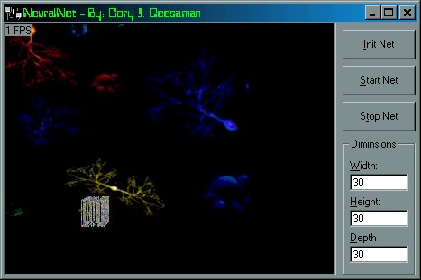



## NeuralNet \- UPDATED

### Description

This is an update to a previous version i submitted a little while ago and am now going to delete, but it has a 3d matrix that stores the neural net. The 3D vertex routines are from Cory Ului, check out his latest code(i think) at: http://planetsourcecode.com/vb/scripts/ShowCode.asp?lngWId=1&txtCodeId=22835 Keywords: 3D three-d three-diminsional 3-diminsional matrix neuron neural network AI
 
### More Info
 

             |
---                |---
**Submitted On**   |2001-05-13 11:41:38
**By**             |[Cory J\. Geesaman](https://github.com/Planet-Source-Code/PSCIndex/blob/master/ByAuthor/cory-j-geesaman.md)
**Level**          |Intermediate
**User Rating**    |4.2 (42 globes from 10 users)
**Compatibility**  |VB 5\.0, VB 6\.0
**Category**       |[Custom Controls/ Forms/  Menus](https://github.com/Planet-Source-Code/PSCIndex/blob/master/ByCategory/custom-controls-forms-menus__1-4.md)
**World**          |[Visual Basic](https://github.com/Planet-Source-Code/PSCIndex/blob/master/ByWorld/visual-basic.md)
**Archive File**   |[NeuralNet 195835132001\.zip](https://github.com/Planet-Source-Code/cory-j-geesaman-neuralnet-updated__1-23158/archive/master.zip)

